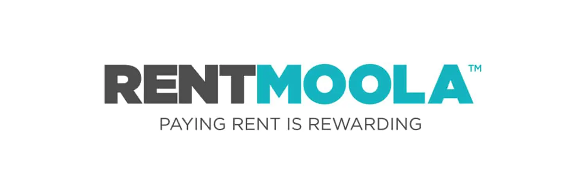

# RentMoola - Simplifying payments in the rental market

---

## Overview and origin

RentMoola Payment Solutions Inc. ("RentMoola") is a disruptive cloud platform that empowers consumers to take control of their finances through a simple, integrated, and secure solution that is powered by a world-class partner ecosystem. We focus on empowering landlords to mitigate risk and offering tenants a wide range of services to manage their finances.[¹](https://rentmoola.com/)

RentMoola was founded in 2013 by twin brothers Philipp and Patrick Postrehovsky.

While living in Shanghai, Patrick experienced the hassle of paying rent with cash. He would scramble to make multiple ATM withdrawals over four consecutive days to be cautious about exceeding his daily ATM limit. Upon returning to Canada, Patrick co-founded RentMoola in 2013 alongside his twin brother, aiming to solve the age-old problem of paying and collecting rent with cheques or cash.

Today, RentMoola is an innovative fintech company, processing hundreds of millions in annual payments, with a growing revenue and user base.[²](https://rentmoola.com/press/releases/rentmoola-co-founder-to-step-down-as-ceo) RentMoola was a pioneer in developing the emerging rent payment vertical, with MasterCard, Visa, American Express, and most recently, BMO.[³](https://www.prnewswire.com/news-releases/optimal-payments-partners-with-rentmoola-to-digitize-the-rental-market-506607391.html)

RentMoola received two venture capital rounds of $5 million each in March 2016 and July 2017.[⁴](https://www.crunchbase.com/organization/rentmoola/company_financials) More recently, in June 2019, Rentmoola closed a $3.5 million preferred share offering.[⁵](https://rentmoola.com/press/releases/rentmoola-closes-preferred-share-offering)

---

## Business activities

RentMoola is an online payment platform allowing tenants to conveniently pay rent and condominium fees to their landlords and/or property managers using a debit card, credit card, or RM Cash™.

The tenant pays a small service fee to use the platform and gains access to the MoolaPerks program, earning rewards and discounts on home, lifestyle, and travel services redeemable across North America, the UK and Europe.

RentMoola’s online platform enables users to pay rent and other disbursements from anywhere in the world, at any-time, and allows the option of setting up one-time or recurring payments.

RentMoola’s mission is to streamline the rent process by simplifying payments into one efficient, secure platform for both tenants and property managers. In an age of rapidly emerging card and online payments, cash and cheques are becoming inherently unreliable and inefficient ways to pay.

RentMoola is heavily reliant on developing a large network and thus aims to attract two user groups to its platform:

* **Tenants and condo owners:** Provides tenants a more flexible, convenient and efficient way to pay their rent; helping to eliminate late payments and bounced cheques, while saving time.
* **Property-management companies:** Normally landlords do not typically accept rent payments by credit card because they are not willing to pay processing fees to credit companies and lower profit margins. However, RentMoola acts as a third-party service provider and attracts property management companies with zero fees. Working with RentMoola, property-management companies can receive rent online, eliminating potential fraud and theft by having to handle cash and cheque deposits. Property managers and owners instantly receive notification of the payment and can manage their cash flow better. RentMoola concentrates on signing-up medium-sized property managers with 500 to 60,000 or more units.

While RentMoola is not the only such service provider, it does enjoy the first-mover advantage as it is the pioneer of bringing this service to Canadians.

---

## Landscape

RentMoola operates in the payments industry within the real-estate realm. RentMoola's competitors include:

* **Dwello (Toronto, ON):** Dwello is an online platform that connects landlords and tenants and automates rental payments, eliminating the need for cheques.

* **Cozy (Portland, Oregon):** Cozy is a property management software offering features such as rent collection, screening tenants, and reviewing online applications.

* **TenantPay (Vancouver, BC):** TenantPay provides tenants a faster and easier online payment option without the need to relinquish as much personal information as for pre-authorized payments.

---

## Major fintech trends and innovations (payments industry) in the last decade [⁶](https://www.forbes.com/sites/lawrencewintermeyer/2019/12/26/ten-years-of-fintech-megatrends-for-the-next-decade/)

Innovations in the payments industry within the fintech domain can be categorized within the following broad categories:

* **Digital payments:** This category was revolutionized by the like of PayPal and WorldPay over 20 years ago. In the last decade digital payments has raced ahead thanks to RFID and mobile apps and there is much to play for in this growing market expected to be worth $2 trillion by 2025.

    Market leaders include Ant Financial, Stripe and Square. Klarna has transformed consumer retail purchasing through services for merchants in the “payments as a service” market. Mastercard and Visa dominate the global card market for payments, a point not lost on Apple who has partnered with Mastercard and Goldman Sachs to launch Apple Card.

    M-Pesa is the poster child for mobile payments and deposits in Africa, has 17 million customers in Kenya and has expanded to South Africa, India and Eastern Europe. The Nordics have Swish (Nordea) and VIPPS (DnB) that allow peer to peer money transfers between consumers and to businesses, popular apps with high consumer adoption rates, delivered by incumbents.

* **Money transfer:** An early fintech play in the $600 billion remittances market that has revolutionized the cost of sending money abroad for workers from counties such as the Philippines, Mexico and India. Fees have dropped from high rates of up to 17 percent of the value of transaction, to zero.

    No huge tech innovation here but great business model innovation. Apps are built on legacy infrastructure using customer bank accounts for KYC / AML and benefit from the legacy infrastructure, the fintech takes its margin on the foreign exchange spread.

    Big players include XE, OFX and TransferWise.

* **Alternative lending:** P2P Lending is an early fintech play that has focused the globally fragmented lending market. Estimated at over $200 billion P2P lending grew substantially following the financial crisis when big banks were not lending. P2P lenders often deploy more sophisticated data driven credit models than traditional banks and have much lower operating costs with no branches.

    Big players include Lending Club, Funding Circle and SoFi. OakNorth, one of Europe’s highest valued fintechs, is taking on the P2P segment focused on the "M" in the "SME" market and a third party data driven tech offering. The opportunities for retail and SME lending have not been lost on traditional players with new entrants such as Goldman Sachs Marcus offering loans and Amazon re-focusing on its next wave of business lending solutions.

* **Bitcoin, Cryptocurrency, Digital Assets, the Blockchain and Distributed Ledger Technologies:** Bitcoin was launched on the blockchain in 2009 following Satoshi Nakamoto's 2008 whitepaper and the rest is history - blockchain sent a thousand projects sailing across all sectors although it took some time getting noticed. A decade in and we are only just getting started.

    Forecasts that this sector will cross the $25 billion mark by 2025. The FSB, BIS, and IOSCO are all focused on analysing the market impact of stablecoins and central banks are reviewing their plans for digital fiat currencies.

    Following the ICO crash and pullback of the bitcoin price in 2018 the sector has regrouped with an enterprise focus: new digital assets and derivatives, and a focus on exchange, custody and settlement infrastructure. Market leaders include R3 with its Corda platform and Six the Swiss stock exchange, who will partner to platform digital assets; a JP Morgan Coin for client payments; and Fidelity Digital Assets platform for institutional clients.

* **Challenger banks:** More challenger banks have popped up in the past few years than you can shake a stick at. A greater flexibility in the licensing options for new banks along with a new generation of banking infrastructure partners has reduced both statutory and working capital requirements to get their plays to market.

    Most of the plays focus on delivering outstanding brand driven customer services on mobile and internet technologies. These include savings and current accounts, payments, cards and loans, and many are moving into share trading and investments, connecting up the “wealth account” to the “current account”.

    Challenger banks are transforming banking in the same way low cost airlines transformed the service proposition of national air carriers. Low cost airlines did not put national carriers out of business, but significantly expanded the air travel market with customers that did not as regularly use airlines.

    Market leaders include Chime, Revolut and Monzo, and while most are a long way from making a profit they are attracting new customers, an outcome not to be discounted in an often fickle and inert consumer marketplace.

---

## Results

Since RentMoola is a private company, it is not required to disclose its book of business to the public. However, the company claims that it is a market-leader in this space when compared to some of the competitors listed above. RentMoola claims that it is in over 400 cities across North America and continues to increase its market share of the $550+ billon in rent paid in the U.S.

In January 2017, RentMoola announced that, as a part of its growth strategy, it has opened an office in San Francisco to lead and grow RentMoola's sales and partnership channel growth.[⁷](https://rentmoola.com/press/releases/rentmoola-opens-san-francisco-office)

---

## Recommendations

Currently, RentMoola offers an array of services and features for both tenents and landlords. However, one feature that RentMoola could integrate into their platform is the option for prospective tenants to search for available units available to rent.

Integrating this feature into their platform will result in the following benefits:

* Access to bigger market share as they will enter the process much earlier than they do currently.

* Incentive for brokers to sign-up as the platform already provides important services such as tenant insurance, credit check for landlords, security deposit alternatives, etc.

* Incentive for property managers as a lot of their work (i.e., background checks, managing deposits, etc.) can all be managed from within the RentMoola platform.

In my opinion, implementing the above feature may not be a very difficult task as it can be done by adding an API. I believe that since the Canadian real estate market is highly regulated, the required information (i.e., list of brokers, active listings, etc.) is readily available. Considering this, creating an API may not be all that difficult, thereby, giving RentMoola access to a much greater untapped market. 